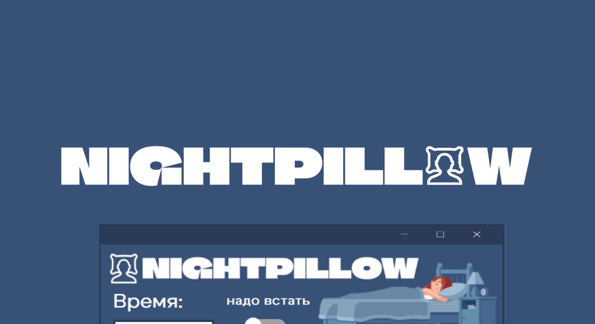

<h1 align="center">
  
</h1>

<h1 align="center">
  
  PyQt5 App Template: NightPillow

    
  [](#)
  [](#)
  [](https://github.com/n1xsi/paasword-tkinter/blob/main/LICENSE)
  
</h1>

Приложение для расчёта оптимального времени сна **«NightPillow»** — это простой проект-шаблон для создания десктопных приложений на Python с использованием фреймворка **PyQt5**.

## 🎯 Зачем нужен этот проект?

Цель данного репозитория — быть понятным и структурированным **шаблоном** (*template*).

Этот репозиторий будет полезен, если вы:
*   **Начинаете изучение PyQt** и хотите увидеть пример структуры проекта, не прописывая весь код в одном файле.
*   **Ищете готовую основу** для своей небольшой утилиты, чтобы не настраивать всё с нуля.
*   **Хотите понять**, как отделить логику приложения от его визуального представления (принцип Model-View-Controller).
*   **Сталкивались с проблемами** при работе с ресурсами (картинками, иконками) после сборки проекта в .exe файл и хотите увидеть рабочее решение.

## ✨ Возможности шаблона

Этот проект демонстрирует лучшие практики для создания небольших приложений:

*   **🏗️ Архитектура, подобная «MVC»**:
    *   **Model (`calculator.py`)**: Содержит всю бизнес-логику и вычисления, не зависит от интерфейса.
    *   **View (`main_window.py`)**: Отвечает только за создание, стилизацию и размещение виджетов.
    *   **Controller (`main.py`/`AppController`)**: Связывает логику и представление, обрабатывает действия пользователя.
*   **🖼️ Управление ресурсами**: Функция `resource_path` в `utils.py` обеспечивает корректный доступ к ресурсам (картинкам, иконкам, шрифтам) как при запуске из исходников, так и в собранном `.exe` файле.
*   **🛠️ Централизованная конфигурация**: Все константы (цвета, тексты, размеры, пути) вынесены в `constants.py` для легкой настройки.
*   **🗃️ Чистая структура проекта**: Логические части приложения разнесены по разным файлам и папкам.
*   **🧩 Стилизация через QSS**: Показан пример применения *Qt Style Sheets* для кастомизации внешнего вида.
*   **📝 Управление зависимостями**: Имеется файл `requirements.txt` для быстрой и простой установки.
*   **📦 Готовность к сборке**: Проект легко собирается в один исполняемый файл с помощью PyInstaller.

## 🚀 Установка и запуск

1.  **Клонирование репозитория:**
    ```bash
    git clone https://github.com/n1xsi/nightpillow-pyqt5.git
    cd nightpillow-pyqt5
    ```

2.  **Создание виртуального окружения:**
    *   На Windows:
        ```bash
        python -m venv venv
        .\venv\Scripts\activate
        ```
    *   На macOS / Linux:
        ```bash
        python3 -m venv venv
        source venv/bin/activate
        ```

3.  **Установление зависимостей:**
    ```bash
    pip install -r requirements.txt
    ```

4.  **Запуск приложения:**
    ```bash
    python main.py
    ```

## 📦 Сборка в единый .exe файл
Чтобы собрать проект в один исполняемый файл, который будет работать на Windows даже **без установленного Python**, используйте **PyInstaller**.

1.  **Установите PyInstaller:**
    ```bash
    pip install pyinstaller
    ```

2.  **Запустите сборку из корневой папки проекта:**
    ```bash
    pyinstaller --name "NightPillow" --onefile --windowed --icon "resources/images/logo.ico" --add-data "app;app" --add-data "resources;resources"  "main.py"
    ```
    *   `--name`: устанавливает имя окна приложения.
    *   `--onefile`: собирает всё в один единый файл.
    *   `--windowed`: убирает консольное окно на фоне.
    *   `--icon`: устанавливает иконку для приложения.
    *   `--add-data "ПАПКА;ПАПКА"`: добавить папку с ресурсами в сборку.

    Готовый `.exe` файл появится в папке `dist`.

## 📄 Лицензия

Этот проект распространяется под лицензией MIT. Подробности смотрите в файле [LICENSE](LICENSE).
